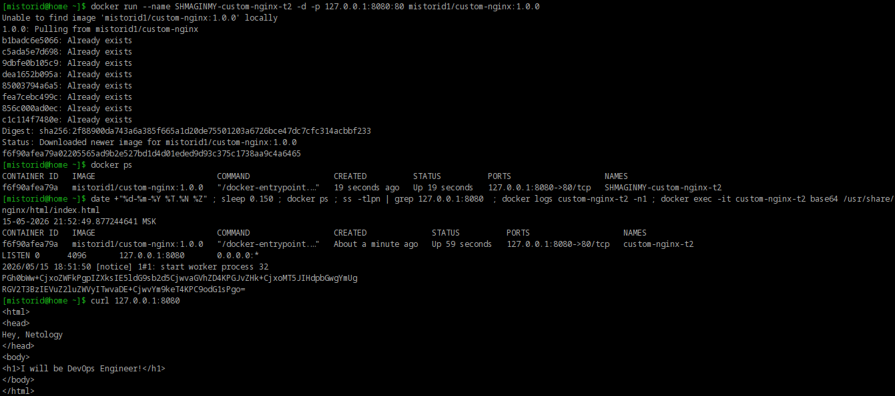
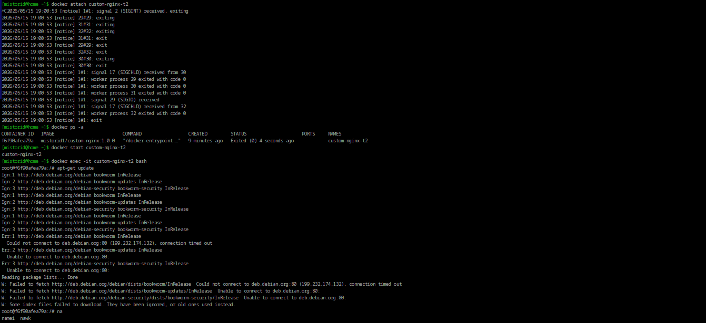
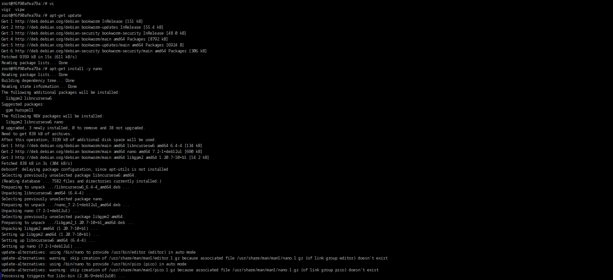
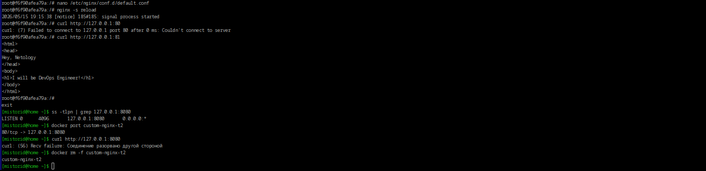
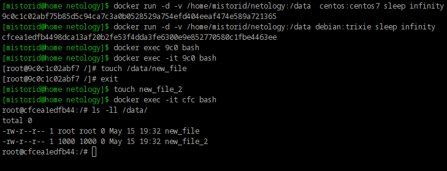
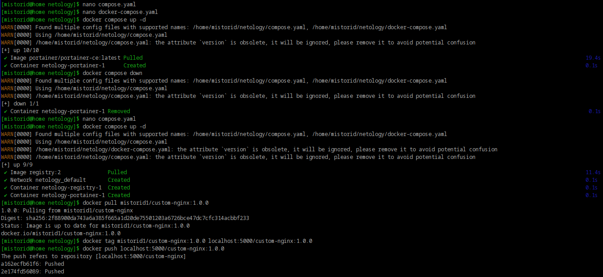
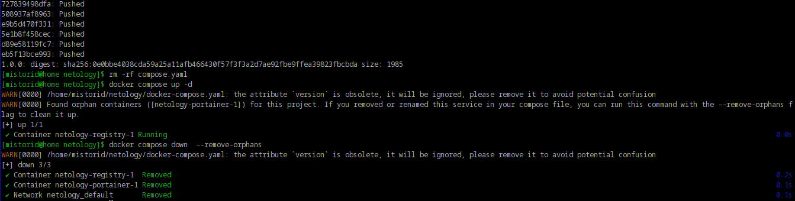
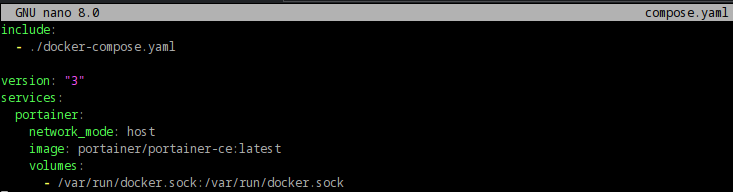
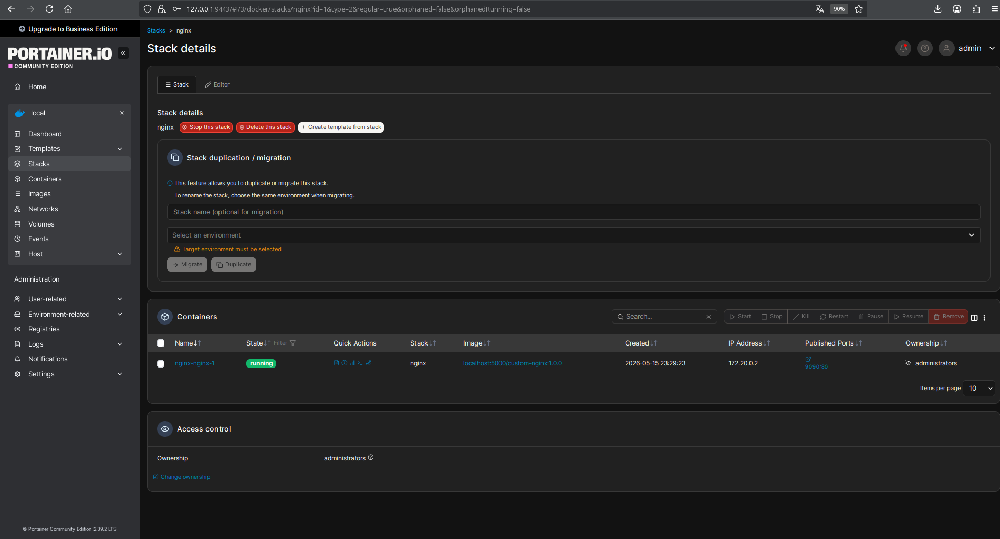
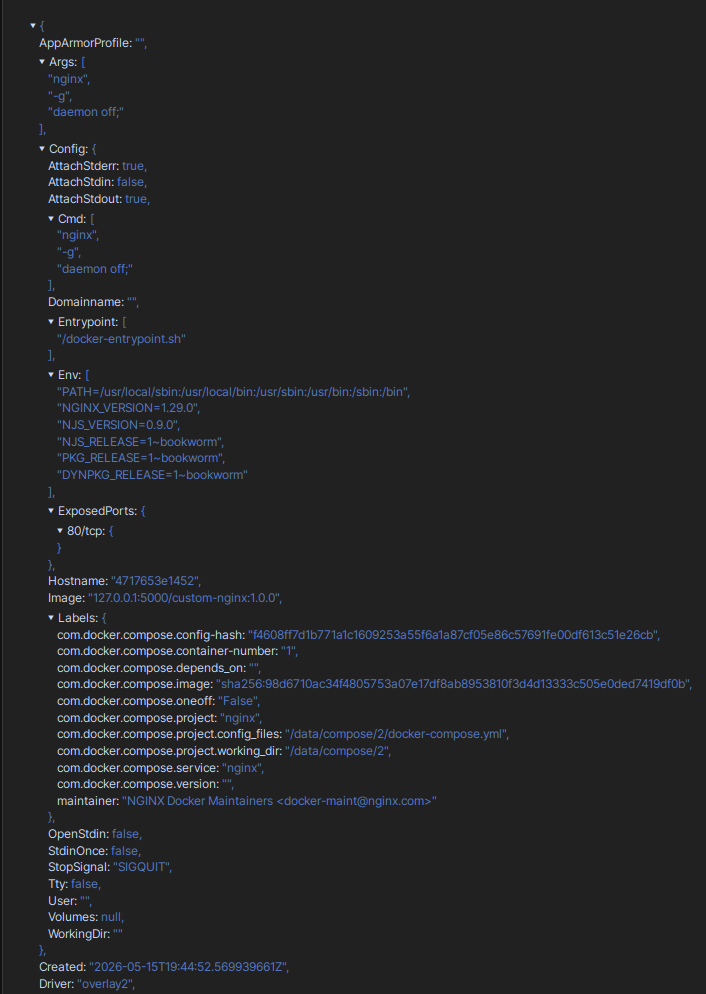

# Домашнее задание к занятию "`Защита сети`" - `Шмагин Максим`


### Задание 1.

Сценарий выполнения задачи:

    Установите docker и docker compose plugin на свою linux рабочую станцию или ВМ.
    Если dockerhub недоступен создайте файл /etc/docker/daemon.json с содержимым: {"registry-mirrors": ["https://mirror.gcr.io", "https://daocloud.io", "https://c.163.com/", "https://registry.docker-cn.com"]}
    Зарегистрируйтесь и создайте публичный репозиторий с именем "custom-nginx" на https://hub.docker.com (ТОЛЬКО ЕСЛИ У ВАС ЕСТЬ ДОСТУП);
    скачайте образ nginx:1.29.0;
    Создайте Dockerfile и реализуйте в нем замену дефолтной индекс-страницы(/usr/share/nginx/html/index.html), на файл index.html с содержимым:
```code
<html>
<head>
Hey, Netology
</head>
<body>
<h1>I will be DevOps Engineer!</h1>
</body>
</html>
```

    Соберите и отправьте созданный образ в свой dockerhub-репозитории c tag 1.0.0 (ТОЛЬКО ЕСЛИ ЕСТЬ ДОСТУП).
    Предоставьте ответ в виде ссылки на https://hub.docker.com/<username_repo>/custom-nginx/general .


Ответ: 

https://hub.docker.com/r/mistorid1/custom-nginx


### Задание 2.

Запустите ваш образ custom-nginx:1.0.0 командой docker run в соответвии с требованиями:

    имя контейнера "ФИО-custom-nginx-t2"
    контейнер работает в фоне
    контейнер опубликован на порту хост системы 127.0.0.1:8080

    Не удаляя, переименуйте контейнер в "custom-nginx-t2"
    Выполните команду date +"%d-%m-%Y %T.%N %Z" ; sleep 0.150 ; docker ps ; ss -tlpn | grep 127.0.0.1:8080  ; docker logs custom-nginx-t2 -n1 ; docker exec -it custom-nginx-t2 base64 /usr/share/nginx/html/index.html
    Убедитесь с помощью curl или веб браузера, что индекс-страница доступна.

В качестве ответа приложите скриншоты консоли, где видно все введенные команды и их вывод.

Ответ:




### Задание 3.


    Воспользуйтесь docker help или google, чтобы узнать как подключиться к стандартному потоку ввода/вывода/ошибок контейнера "custom-nginx-t2".
    Подключитесь к контейнеру и нажмите комбинацию Ctrl-C.
    Выполните docker ps -a и объясните своими словами почему контейнер остановился.
    Перезапустите контейнер
    Зайдите в интерактивный терминал контейнера "custom-nginx-t2" с оболочкой bash.
    Установите любимый текстовый редактор(vim, nano итд) с помощью apt-get.
    Отредактируйте файл "/etc/nginx/conf.d/default.conf", заменив порт "listen 80" на "listen 81".
    Запомните(!) и выполните команду nginx -s reload, а затем внутри контейнера curl http://127.0.0.1:80 ; curl http://127.0.0.1:81.
    Выйдите из контейнера, набрав в консоли exit или Ctrl-D.
    Проверьте вывод команд: ss -tlpn | grep 127.0.0.1:8080 , docker port custom-nginx-t2, curl http://127.0.0.1:8080. Кратко объясните суть возникшей проблемы.
        Это дополнительное, необязательное задание. Попробуйте самостоятельно исправить конфигурацию контейнера, используя доступные источники в интернете. Не изменяйте конфигурацию nginx и не удаляйте контейнер. Останавливать контейнер можно. пример источника
    Удалите запущенный контейнер "custom-nginx-t2", не останавливая его.(воспользуйтесь --help или google)

В качестве ответа приложите скриншоты консоли, где видно все введенные команды и их вывод.

Ответ:








### Задание 4.


    Запустите первый контейнер из образа centos c любым тегом в фоновом режиме, подключив папку текущий рабочий каталог $(pwd) на хостовой машине в /data контейнера, используя ключ -v.
    Запустите второй контейнер из образа debian в фоновом режиме, подключив текущий рабочий каталог $(pwd) в /data контейнера.
    Подключитесь к первому контейнеру с помощью docker exec и создайте текстовый файл любого содержания в /data.
    Добавьте ещё один файл в текущий каталог $(pwd) на хостовой машине.
    Подключитесь во второй контейнер и отобразите листинг и содержание файлов в /data контейнера.

В качестве ответа приложите скриншоты консоли, где видно все введенные команды и их вывод.

Ответ:




### Задание 5.


    Создайте отдельную директорию(например /tmp/netology/docker/task5) и 2 файла внутри него. "compose.yaml" с содержимым:

version: "3"
services:
  portainer:
    network_mode: host
    image: portainer/portainer-ce:latest
    volumes:
      - /var/run/docker.sock:/var/run/docker.sock

"docker-compose.yaml" с содержимым:

version: "3"
services:
  registry:
    image: registry:2

    ports:
    - "5000:5000"

И выполните команду "docker compose up -d". Какой из файлов был запущен и почему? (подсказка: https://docs.docker.com/compose/compose-application-model/#the-compose-file )

    Отредактируйте файл compose.yaml так, чтобы были запущенны оба файла. (подсказка: https://docs.docker.com/compose/compose-file/14-include/)

    Выполните в консоли вашей хостовой ОС необходимые команды чтобы залить образ custom-nginx как custom-nginx:latest в запущенное вами, локальное registry. Дополнительная документация: https://distribution.github.io/distribution/about/deploying/

    Откройте страницу "https://127.0.0.1:9000" и произведите начальную настройку portainer.(логин и пароль адмнистратора)

    Откройте страницу "http://127.0.0.1:9000/#!/home", выберите ваше local окружение. Перейдите на вкладку "stacks" и в "web editor" задеплойте следующий компоуз:

version: '3'

services:
  nginx:
    image: 127.0.0.1:5000/custom-nginx
    ports:
      - "9090:80"

    Перейдите на страницу "http://127.0.0.1:9000/#!/2/docker/containers", выберите контейнер с nginx и нажмите на кнопку "inspect". В представлении <> Tree разверните поле "Config" и сделайте скриншот от поля "AppArmorProfile" до "Driver".

    Удалите любой из манифестов компоуза(например compose.yaml). Выполните команду "docker compose up -d". Прочитайте warning, объясните суть предупреждения и выполните предложенное действие. Погасите compose-проект ОДНОЙ(обязательно!!) командой.

В качестве ответа приложите скриншоты консоли, где видно все введенные команды и их вывод, файл compose.yaml , скриншот portainer c задеплоенным компоузом.

Ответ:












Ошибки после выполнения п. 7

После удаления файла `compose.yaml` и повторного запуска `docker compose up -d` появилось предупреждение:

```text
WARN[0000] Found orphan containers ([netology-portainer-1]) for this project.
If you removed or renamed this service in your compose file, you can run this
command with the --remove-orphans flag to clean it up.
```

Суть предупреждения

Docker Compose помечает каждый запущенный контейнер меткой проекта  
(`com.docker.compose.project=netology` — имя берётся из имени директории).

Когда выполняется `docker compose up`, Compose делает следующее:

1. Смотрит, какие сервисы описаны в текущем compose-файле — сейчас это только `registry` (потому что `compose.yaml` с portainer был удалён, а директива `include` больше нигде не объявлена).
2. Смотрит, какие контейнеры уже запущены с меткой проекта `netology` — находит `netology-portainer-1` и `netology-registry-1`.
3. Сравнивает оба списка и видит расхождение: контейнер `netology-portainer-1` существует, но в текущем compose-файле сервиса `portainer` больше нет.

Такой контейнер называется **orphan** («осиротевший») — у него больше нет «родителя» в манифесте.

> Compose не убивает orphan-контейнеры автоматически (вдруг это нужный контейнер, который вы не хотите терять) — он только предупреждает.

Решение

Выполнить предложенное самим Compose действие — добавить флаг `--remove-orphans`:

```bash
docker compose up -d --remove-orphans
```

После этого Compose оставит работающим `netology-registry-1` и удалит `netology-portainer-1`.

